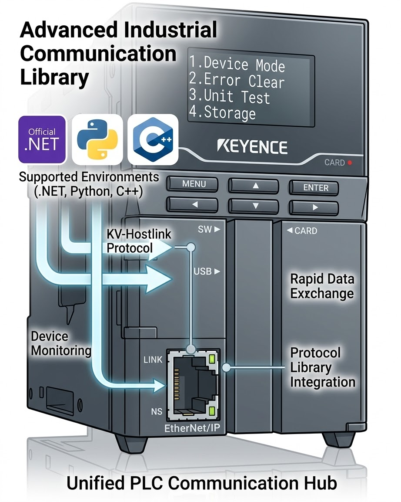

[](https://github.com/fa-yoshinobu/plc-comm-hostlink-python/actions/workflows/test.yml)
[](https://fa-yoshinobu.github.io/plc-comm-hostlink-python/)
[](https://pypi.org/project/kv-hostlink/)
[](https://www.python.org/downloads/)
[](LICENSE)
[](https://github.com/astral-sh/ruff)
[](http://mypy-lang.org/)

# KV Host Link Protocol for Python



High-performance Python library for KEYENCE KV series PLCs using the Host Link
(Upper Link) protocol.

This README intentionally covers the recommended high-level helper API only:
`HostLinkConnectionOptions`, `open_and_connect`, `normalize_address`,
`read_typed`, `write_typed`, `write_bit_in_word`, `read_named`, `poll`,
`read_words_single_request`, `read_dwords_single_request`,
`read_words_chunked`, and `read_dwords_chunked`.

Low-level client methods and protocol-level details are kept in maintainer
documentation.

## Key Features

- High-level helper API for typed reads, writes, snapshots, and polling
- Typed helpers for `U`, `S`, `D`, `L`, and helper-level `F`
- Mixed snapshots with `read_named`
- Batch-friendly polling with `poll`
- Contiguous block helpers with explicit `single_request` and `chunked` entry points
- Hardware-verified against KV-7500

## Installation

Install the latest PyPI release:

```bash
pip install kv-hostlink
```

For local development:

```bash
git clone https://github.com/fa-yoshinobu/plc-comm-hostlink-python.git
cd plc-comm-hostlink-python
pip install -e .
```

Published metadata lives at https://pypi.org/project/kv-hostlink/, where wheel/tarball downloads are also available.

## Quick Start

```python
import asyncio

from hostlink import HostLinkConnectionOptions, open_and_connect, read_named, read_typed, write_typed


async def main() -> None:
    options = HostLinkConnectionOptions(
        host="192.168.250.100",
        port=8501,
        transport="tcp",
        timeout=3.0,
    )
    async with await open_and_connect(options) as client:
        dm0 = await read_typed(client, "DM0", "U")
        await write_typed(client, "DM10", "U", dm0)

        snapshot = await read_named(
            client,
            ["DM0", "DM1:S", "DM2:D", "DM4:F", "DM10.0"],
        )
        print(snapshot)


if __name__ == "__main__":
    asyncio.run(main())
```

## Common Workflows

Address normalization:

```python
from hostlink import normalize_address

print(normalize_address("dm100"))    # DM100
print(normalize_address("dm100.a"))  # DM100.A
```

Typed block reads:

```python
words = await read_words_single_request(client, "DM100", 10)
dwords = await read_dwords_single_request(client, "DM200", 4)
```

Explicit chunked contiguous reads:

```python
large_words = await read_words_chunked(client, "DM1000", 1000)
large_dwords = await read_dwords_chunked(client, "DM2000", 120)
```

Bit-in-word update:

```python
await write_bit_in_word(client, "DM50", bit_index=3, value=True)
```

Polling:

```python
async for snapshot in poll(client, ["DM100", "DM101:L", "DM50.3"], interval=1.0):
    print(snapshot)
```

## Sample Programs

User-facing high-level examples:

- `samples/high_level_async.py`
- `samples/high_level_sync.py`
- `samples/basic_high_level_rw.py`
- `samples/named_snapshot.py`
- `samples/polling_monitor.py`

API and workflow to sample mapping:

| API / workflow | Primary sample | Purpose |
|---|---|---|
| `HostLinkConnectionOptions`, `open_and_connect`, `read_typed`, `write_typed`, `read_words_single_request`, `read_dwords_single_request`, `write_bit_in_word`, `read_named`, `poll` | `samples/high_level_async.py` | End-to-end async walkthrough of the full helper surface |
| Synchronous CLI entrypoint for the same helper surface | `samples/high_level_sync.py` | Shows how to wrap the async helper API behind `asyncio.run` |
| `read_typed`, `write_typed` | `samples/basic_high_level_rw.py` | Focused typed read/write mirror example |
| `read_named` | `samples/named_snapshot.py` | Mixed typed and bit-in-word snapshot example |
| `poll` | `samples/polling_monitor.py` | Repeated snapshot monitoring loop |

Run examples:

```bash
python samples/high_level_async.py --host 192.168.250.100
python samples/high_level_sync.py --host 192.168.250.100
python samples/basic_high_level_rw.py --host 192.168.250.100
python samples/named_snapshot.py --host 192.168.250.100
python samples/polling_monitor.py --host 192.168.250.100 --poll-count 5
```

## Documentation

User documentation:

- [User Guide](docsrc/user/USER_GUIDE.md)
- [API Reference](docsrc/user/API_REFERENCE.md)
- [Troubleshooting](docsrc/user/TROUBLESHOOTING.md)
- [Performance Tuning](docsrc/user/PERFORMANCE_GUIDE.md)
- [Samples](samples/README.md)

Maintainer and QA documentation:

- [QA Evidence](docsrc/validation/reports/)
- [Protocol Specification](docsrc/maintainer/PROTOCOL_SPEC.md)
- [Specification Coverage](docsrc/maintainer/SPEC_COVERAGE.md)
- [API Unification Policy](docsrc/maintainer/API_UNIFICATION_POLICY.md)

## Verified Hardware

- CPU: KV-7500
- Ethernet: built-in Ethernet port and KV-XLE02
- Transport: TCP and UDP

## Development and Release Checks

```bash
run_ci.bat
release_check.bat
```

`run_ci.bat` runs lint, format, mypy, high-level docs coverage checks,
user-facing sample validation, and tests.

`release_check.bat` runs `run_ci.bat` and then rebuilds the published docs.

## License

Distributed under the MIT License.
